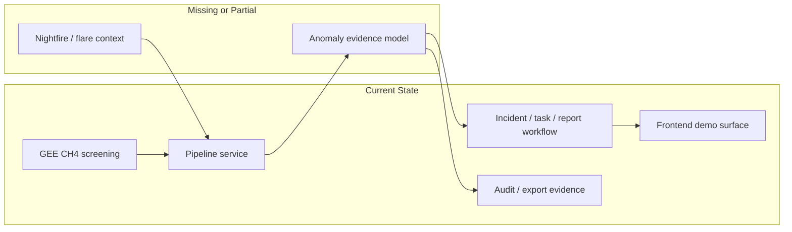

# feat: Close hackathon scope gaps for Saryna MRV

## Overview

This plan compares the current repository state to the intended Kazakhstan Startup Challenge scope and defines the minimum completion path that improves submission readiness without breaking the demo loop. The repo already has a strong MRV workflow shell, a contest-safe API contract, and substantial pitch materials. The remaining work is mostly about credibility gaps: live ingest proof that changes too little, no flare adapter beyond narrative framing, no runtime-smoke tests, no persistence, and no true geospatial map stack despite the intended architecture.

## Problem Frame

The intended hackathon product is not a dashboard. It is an MRV workflow for methane and flaring visibility:

`signal -> incident -> task -> MRV report`

The repository already expresses this product story clearly in `docs/project-brief.md`, `docs/contest-research.md`, and the current `apps/web` / `apps/api` code. The gap is that the codebase is still primarily a demo-safe seeded workflow with a live Earth Engine proof path, not a full ingest-normalize-operate stack. For submission and judging, that is acceptable only if the remaining work strengthens demo credibility faster than it adds technical risk.

## Requirements Trace

- R1. Assess what is already implemented against the intended hackathon scope.
- R2. Separate implemented, partially implemented, missing, and weak-for-demo areas.
- R3. Produce a prioritized completion plan grounded in exact repo files and current patterns.
- R4. Protect the main judging differentiator: `anomaly -> incident -> task -> MRV report`.
- R5. Prioritize work that improves submission credibility by April 3, 2026 and final-stage confidence by April 9, 2026.

## Scope Boundaries

- This plan does not attempt a full post-hackathon architecture build.
- This plan intentionally avoids auth, RBAC, mobile, microservices, Kubernetes, realtime streaming, or heavy ML.
- This plan does not require replacing the demo-safe workflow with a full production geospatial backend before submission.
- This plan treats local pitch/docs artifacts as part of the completion scope because judging strength depends on them.

## Context & Research

### Relevant Code and Patterns

- `docs/project-brief.md`
  - Defines the intended contest scope, the demo loop, and the screening-layer positioning.
- `docs/contest-research.md`
  - Defines the judging frame, MVP minimum, and Kazakhstan relevance.
- `README.md`
  - Summarizes currently implemented demo-safe features and the intended stack.
- `apps/api/app/api/routes.py`
  - Current typed API contract for dashboard, pipeline status/sync, anomalies, incidents, tasks, audit, and report export/view.
- `apps/api/app/services/demo_store.py`
  - In-memory contest-safe workflow store and current seeded/live hybrid behavior.
- `apps/api/app/services/pipeline_service.py`
  - Current seeded vs Earth Engine pipeline-state orchestration.
- `apps/api/app/providers/gee.py`
  - Current Earth Engine adapter; proves access and retrieves a Kazakhstan-wide CH4 summary, but does not yet generate real anomaly objects.
- `apps/api/app/models.py`
  - Current typed data contract, including activity/audit events and pipeline status.
- `apps/web/lib/api.ts`
  - Frontend adapter layer with API-first/fallback-second behavior.
- `apps/web/app/page.tsx`
  - Current contest demo surface implementing the full workflow and presenter cues.
- `apps/web/lib/demo-data.ts`
  - Current seeded fallback data.

### Institutional Learnings

- No `docs/solutions/` directory exists in the repo, so there are no institutional learnings to carry forward.

### External References

- No external research was required for this plan. The repo, README, and local docs already provide enough context to produce a grounded completion plan.

## Current State Assessment

### Already Implemented

- Core MRV demo loop exists in the frontend:
  - `apps/web/app/page.tsx`
  - The UI supports signal review, incident opening, verification tasks, report generation, audit timeline, export, and print view.
- API-first contract exists for the core workflow:
  - `apps/api/app/api/routes.py`
  - `apps/web/lib/api.ts`
- Demo-safe seeded backend state exists:
  - `apps/api/app/services/demo_store.py`
- Structured audit/evidence model exists:
  - `apps/api/app/models.py`
  - `apps/api/app/services/demo_store.py`
  - `apps/web/lib/api.ts`
  - `apps/web/lib/demo-data.ts`
- Earth Engine live proof path exists:
  - `apps/api/app/providers/gee.py`
  - `apps/api/app/services/pipeline_service.py`
  - `apps/web/app/page.tsx`
- Stage-safe live sync and seeded reset exist:
  - `apps/web/app/page.tsx`
- Contest support materials are strong and unusually complete:
  - `docs/demo-script.md`
  - `docs/pitch-qna-pack.md`
  - `docs/final-submission-pack.md`
  - `docs/slide-deck-outline.md`
  - `docs/slide-copy-pack.md`
  - `docs/submission-form-pack.md`

### Partially Implemented

- Methane live ingest exists only as a broad screening summary, not as real anomaly generation:
  - `apps/api/app/providers/gee.py`
  - `apps/api/app/services/pipeline_service.py`
  - `apps/api/app/services/demo_store.py`
- Pipeline status exists, but the actual data path is still mostly demo-state mutation rather than a full ingest-normalize-anomaly pipeline:
  - `apps/api/app/services/pipeline_service.py`
  - `apps/api/app/services/demo_store.py`
- Frontend/backend integration exists, but the repo still assumes fallback-first resilience rather than a truly verified backend runtime:
  - `apps/web/lib/api.ts`
  - `apps/web/app/page.tsx`
  - `docs/backend-live-sync.md`
- Audit trail is strong for judging, but it is still backed by in-memory contest state:
  - `apps/api/app/services/demo_store.py`
- Geographic context is partially represented through a stylized “map plane” rather than a true map stack:
  - `apps/web/app/page.tsx`
  - `apps/web/app/globals.css`

### Missing

- Real flare adapter / Nightfire ingestion path:
  - There is no `apps/api/app/providers/nightfire.py` or equivalent.
- Persistence layer:
  - No SQLAlchemy models
  - No PostgreSQL / PostGIS integration
  - No migration tooling
- Background job layer:
  - No APScheduler or Celery configuration
- Storage layer:
  - No S3-compatible or Supabase artifact persistence
- Real geospatial frontend stack from the intended architecture:
  - `apps/web/package.json` does not include MapLibre or Recharts even though the intended stack names them.
- Repo-owned tests:
  - No application tests exist under `apps/api/tests/` or `apps/web/tests/`
- Runtime-verified backend workflow inside this environment:
  - `docs/backend-live-sync.md` exists, but the repo still lacks committed smoke coverage proving the contract behavior.

### Weak For Demo / Judging

- Live sync currently proves access more than it proves operational data transformation:
  - `apps/api/app/providers/gee.py`
  - `apps/api/app/services/pipeline_service.py`
- The methane + flare story is not fully matched by code because the flare side is still narrative only.
- The frontend looks serious, but the lack of a true map stack could be noticed if the judges expect geographic realism from the stated architecture:
  - `apps/web/package.json`
  - `apps/web/app/page.tsx`
- The entire interactive system is stateful only in memory:
  - backend restart or process loss resets everything
  - `apps/api/app/services/demo_store.py`
- No tests means every late-stage change carries higher demo risk:
  - no repo test files currently exist
- The backend runtime has not been proven in this sandboxed environment:
  - this is a process risk, not a codebase flaw, but it matters for judging confidence

## Key Technical Decisions

- Prioritize demo credibility over architectural completeness.
  - Rationale: The judging differentiator is workflow maturity, not infrastructure depth. Real persistence and jobs matter less than a stable anomaly-to-report loop.
- Treat “real methane summary + seeded anomaly queue” as acceptable for submission, but not as the finish line.
  - Rationale: The current Earth Engine path is enough to prove live ingest access, but it remains too weak to fully support the product claim unless paired with stronger provenance and flare context.
- Add smoke coverage before adding more moving parts.
  - Rationale: The repo currently has zero owned tests. A fragile contest demo is a bigger risk than an incomplete data platform.
- Do not chase a full PostGIS build before submission unless the core runtime is already stable.
  - Rationale: Persistence is important, but it is not the highest-ROI submission work relative to runtime verification, live proof credibility, and demo polish.
- Add a flare-context adapter before adding deeper methane complexity.
  - Rationale: The intended product is methane + flaring visibility. Judging credibility improves more from completing both sides of the narrative than from deepening one side only.

## Open Questions

### Resolved During Planning

- Should submission work prioritize full infrastructure or demo strength?
  - Resolution: Prioritize demo strength and runtime safety first.
- Is the current Earth Engine integration enough to count as “implemented” live ingest?
  - Resolution: It is partially implemented. It proves access and summary retrieval but not full anomaly generation.
- Should MapLibre/Recharts be treated as optional?
  - Resolution: For submission they are optional. For judging perception they are a credibility gap and should be evaluated as a polish item, not a core blocker.

### Deferred to Implementation

- Whether to add a lightweight static geography layer or a true MapLibre view before the final.
  - Deferred because the right answer depends on runtime stability and time remaining after smoke coverage.
- Whether Nightfire should land as a real adapter or a structured CSV/static fallback first.
  - Deferred because it depends on source access and integration friction during implementation.
- Whether persistence should be introduced before the final or after the contest.
  - Deferred because it depends on how stable the current runtime is once smoke-tested.

## High-Level Technical Design

> *This illustrates the intended approach and is directional guidance for review, not implementation specification. The implementing agent should treat it as context, not code to reproduce.*

## Implementation Units

- [ ] **Unit 1: Add repo-owned smoke coverage for the MRV contract**

**Goal:** Reduce contest risk by proving the backend workflow contract and pipeline-state transitions with committed tests.

**Requirements:** R2, R3, R4, R5

**Dependencies:** None

**Files:**
- Modify: `apps/api/pyproject.toml`
- Create: `apps/api/tests/test_routes.py`
- Create: `apps/api/tests/test_pipeline_service.py`
- Create: `apps/api/tests/test_demo_store.py`
- Modify: `docs/backend-live-sync.md`

**Approach:**
- Add lightweight backend test dependencies and cover the core endpoints:
  - `/health`
  - `/api/v1/dashboard`
  - `/api/v1/pipeline/status`
  - `/api/v1/pipeline/sync`
  - task/report flows
- Focus on current seeded/live behavior rather than redesigning the API.
- Validate that seeded reset removes live evidence and that report/export endpoints remain stable.

**Execution note:** Start with failing smoke coverage for the current API contract before deepening the data layer.

**Patterns to follow:**
- Existing typed models in `apps/api/app/models.py`
- Existing route boundaries in `apps/api/app/api/routes.py`

**Test scenarios:**
- Seeded dashboard loads with anomalies, incidents, and audit feed.
- GEE sync returns a typed pipeline status even when Earth Engine is unavailable.
- Seeded reset clears GEE evidence and restores baseline pipeline state.
- Incident promote, task create/complete, and report generation preserve audit continuity.

**Verification:**
- The backend contract can be validated locally without manual clicking.
- The highest-risk demo paths have reproducible regression coverage.

- [ ] **Unit 2: Strengthen live ingest credibility without breaking demo safety**

**Goal:** Make the live CH4 path feel more like product behavior and less like a connectivity proof.

**Requirements:** R1, R2, R4, R5

**Dependencies:** Unit 1

**Files:**
- Modify: `apps/api/app/providers/gee.py`
- Modify: `apps/api/app/services/pipeline_service.py`
- Modify: `apps/api/app/services/demo_store.py`
- Modify: `apps/api/app/models.py`
- Modify: `apps/web/lib/api.ts`
- Modify: `apps/web/app/page.tsx`
- Test: `apps/api/tests/test_pipeline_service.py`
- Test: `apps/web/tests/page.integration.test.tsx`

**Approach:**
- Keep the seeded anomaly queue, but attach stronger source provenance to the lead anomaly:
  - observation window
  - provider/source label
  - what was refreshed
- Ensure the signal queue and incident/report copy remain consistent after sync/reset transitions.
- Avoid pretending to generate exact asset-level methane anomalies if the provider still cannot support that honestly.

**Patterns to follow:**
- Current live-proof mutation flow in `apps/api/app/services/pipeline_service.py`
- Current frontend source badges and audit evidence in `apps/web/app/page.tsx`

**Test scenarios:**
- Live sync marks the lead anomaly/report path with refreshed source evidence.
- Seeded reset fully removes live-only indicators.
- Frontend still remains usable when the live provider returns degraded/error states.

**Verification:**
- Judges can see that live ingest affects the workflow in a visible and honest way.
- Resetting to seeded mode returns the UI to a fully consistent baseline.

- [ ] **Unit 3: Add flare-context ingestion to complete the methane + flaring story**

**Goal:** Close the biggest product-scope gap by giving the backend an actual flare-context source adapter.

**Requirements:** R1, R2, R4, R5

**Dependencies:** Unit 1

**Files:**
- Create: `apps/api/app/providers/nightfire.py`
- Modify: `apps/api/app/services/pipeline_service.py`
- Modify: `apps/api/app/services/demo_store.py`
- Modify: `apps/api/app/models.py`
- Modify: `apps/web/lib/api.ts`
- Modify: `apps/web/app/page.tsx`
- Modify: `docs/backend-live-sync.md`
- Test: `apps/api/tests/test_pipeline_service.py`
- Test: `apps/api/tests/test_demo_store.py`

**Approach:**
- Implement the lightest credible flare-context adapter possible:
  - real adapter if the data source is straightforward
  - otherwise a structured CSV/static ingestion path that is explicit about being an MVP shortcut
- Feed the flare context into the same incident/report narrative instead of creating a second UI universe.
- Keep the frontend workflow unchanged; only enrich the evidence shown in signal/incident/report.

**Execution note:** Favor a stable CSV/static-backed adapter over a risky “fully live” integration if time is short.

**Patterns to follow:**
- Current provider pattern in `apps/api/app/providers/gee.py`
- Current seeded data enrichment pattern in `apps/api/app/services/demo_store.py`

**Test scenarios:**
- Flare-context provider returns structured data the pipeline service can consume.
- Signal narrative/report copy can mention flare context without breaking seeded playback.
- Missing flare data does not block the methane workflow.

**Verification:**
- The repo can credibly claim methane + flaring visibility in code, not only in pitch materials.

- [ ] **Unit 4: Improve judging-facing geographic and evidence readability in the web app**

**Goal:** Make the frontend read more like an oil-and-gas tool from the back of the room.

**Requirements:** R2, R4, R5

**Dependencies:** Units 2-3 (can start earlier if kept lightweight)

**Files:**
- Modify: `apps/web/package.json`
- Modify: `apps/web/app/page.tsx`
- Modify: `apps/web/app/globals.css`
- Modify: `apps/web/lib/demo-data.ts`
- Test: `apps/web/tests/page.integration.test.tsx`

**Approach:**
- Evaluate whether the current stylized map plane should be:
  - kept and visually clarified, or
  - replaced with a lightweight real map/geography layer
- Add more explicit source/evidence readability where it improves judging comprehension:
  - source badges
  - asset/region clarity
  - flare context visibility
- Do not let visual work slow the core loop or destabilize the existing page.

**Patterns to follow:**
- Current step-based layout and cue system in `apps/web/app/page.tsx`
- Current visual language in `apps/web/app/globals.css`

**Test scenarios:**
- Queue, incident, and report screens remain understandable on desktop and mobile.
- Added map/geography context does not block the main workflow or degrade performance noticeably.
- Source/evidence badges remain consistent after sync/reset.

**Verification:**
- The app looks more enterprise-relevant and less abstract for PetroDigital-style judging.

- [ ] **Unit 5: Decide whether persistence is a final-round target or a post-hackathon defer**

**Goal:** Make an explicit architectural decision about whether to land persistence before April 9, 2026.

**Requirements:** R2, R3, R5

**Dependencies:** Units 1-4

**Files:**
- Modify: `README.md`
- Modify: `docs/final-submission-pack.md`
- Create: `apps/api/app/db/__init__.py`
- Create: `apps/api/app/db/models.py`
- Create: `apps/api/app/db/session.py`
- Test: `apps/api/tests/test_persistence_smoke.py`

**Approach:**
- Treat persistence as a gated decision, not an automatic next step.
- Only land it if Units 1-4 are stable and there is enough time for smoke coverage.
- If not, explicitly defer Postgres/PostGIS to post-contest and tighten the pitch language around the current scope.

**Execution note:** Characterization-first if implementation proceeds, because persistence changes the highest-risk state boundary in the repo.

**Patterns to follow:**
- Existing API/service split in `apps/api/app/api/routes.py` and `apps/api/app/services/`

**Test scenarios:**
- Persisted incidents/tasks survive service restart.
- Seeded/demo mode can still be used for presentation safety.
- Persistence layer does not break export or audit history.

**Verification:**
- The team makes a conscious scope decision instead of drifting into infrastructure work by default.

## System-Wide Impact

- **Interaction graph:** The core interaction chain is `provider -> pipeline service -> demo store -> API routes -> frontend adapter -> page state`. Any completion work that touches ingest will propagate through every layer.
- **Error propagation:** Current design uses fallback behavior aggressively. This is good for demo safety but can hide weak backend behavior. Smoke coverage should verify expected fallback boundaries explicitly.
- **State lifecycle risks:** All workflow state is currently in memory. Restart, redeploy, or process failure resets incidents, tasks, and audit history.
- **API surface parity:** The dashboard, activity, incident, task, and report endpoints form one contract. Completion work should avoid creating new standalone paths unless the existing contract cannot carry the needed context.
- **Integration coverage:** Unit tests alone will not prove judging readiness. A local backend smoke pass plus one full frontend run-through remains necessary.

## Risks & Dependencies

- The biggest risk is spending remaining time on infrastructure instead of runtime safety and judging credibility.
- The second biggest risk is overclaiming methane + flaring coverage when only methane has a partial live adapter.
- Earth Engine auth/runtime remains an environment dependency outside this sandbox.
- Adding a real map stack late in the cycle could destabilize the currently strong UX if not kept lightweight.
- Persistence is high-risk relative to current state because there is no existing database scaffold or test suite.

## Documentation / Operational Notes

- Update `docs/backend-live-sync.md` as soon as smoke coverage lands so the runbook matches the tested contract.
- Keep `docs/demo-script.md`, `docs/pitch-qna-pack.md`, and `docs/final-submission-pack.md` aligned with whatever is actually implemented next.
- If flare context lands only as a structured static adapter, document it openly as an MVP shortcut rather than implying a full live integration.

## Sources & References

- Related docs:
  - `docs/project-brief.md`
  - `docs/contest-research.md`
  - `docs/backend-live-sync.md`
  - `docs/demo-script.md`
  - `docs/pitch-qna-pack.md`
  - `docs/final-submission-pack.md`
- Related code:
  - `apps/api/app/api/routes.py`
  - `apps/api/app/models.py`
  - `apps/api/app/providers/gee.py`
  - `apps/api/app/services/demo_store.py`
  - `apps/api/app/services/pipeline_service.py`
  - `apps/web/lib/api.ts`
  - `apps/web/lib/demo-data.ts`
  - `apps/web/app/page.tsx`
  - `apps/web/app/globals.css`
