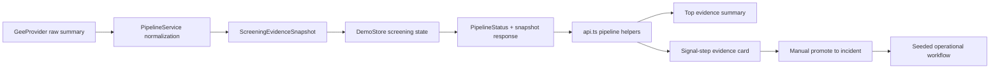

# feat: Add live screening evidence layer

## Overview

This plan upgrades the current Earth Engine sync from a connectivity proof into a visible, operator-readable screening evidence layer. It intentionally does not build a real anomaly-generation engine. Instead, it separates live screening state from the seeded operational workflow so the demo remains stable while the live ingest story becomes materially stronger.

The repo already has:

- a seeded `anomaly -> incident -> task -> MRV report` loop
- FastAPI pipeline endpoints
- Earth Engine summary retrieval
- backend smoke coverage from Unit 1

The missing piece is a stable evidence contract and a visible UI block that shows what changed after sync and why it matters.

## Problem Frame

The current live path updates pipeline status and mutates the strongest anomaly copy in memory, but it still reads more like “Earth Engine connected” than “the screening layer refreshed and changed operator attention.” That is weak for judging because the product claim is about MRV workflow with satellite-informed prioritization, not API connectivity.

The latest `main` branch also no longer visibly uses the existing pipeline helpers in the current page surface, even though `apps/web/lib/api.ts` still supports `loadPipelineStatus()` and `syncPipeline()`. That means Unit 2 must do two things together:

- strengthen the backend evidence model
- explicitly restore evidence visibility in the frontend

## Requirements Trace

Origin: [2026-03-27-live-screening-evidence-layer-requirements.md](D:\oil\Duo-Galym-Dauren-Project\docs\brainstorms\2026-03-27-live-screening-evidence-layer-requirements.md)

- R1. Live sync must update a distinct screening evidence state without destabilizing seeded incidents, tasks, reports, or audit flow.
- R2. The UI must show a visible before/after evidence change after sync, not just a status badge.
- R3. The evidence state must communicate operator-relevant meaning:
  - latest sync time
  - current signal vs baseline
  - delta
  - screening level
  - confidence/caveat note
  - recommended next step
- R4. Promotion into an incident must remain a separate human step after evidence refresh.
- R5. Live provider failures must degrade safely:
  - fresh evidence when available
  - previous/stale evidence when source is reachable but not fresh
  - unavailable state when the provider cannot be used
- R6. The demo must remain stage-safe:
  - no sync failure should break the seeded operational path
  - reset to seeded mode must still be possible

## Success Criteria

- A judge can see a clear before/after screening evidence change after sync.
- The presenter can say: “Satellite data updates screening evidence; a person promotes that evidence into an operational incident.”
- Seeded `incident -> task -> report` behavior remains unchanged before and after sync.
- The API exposes fresh, stale, and unavailable evidence states in a stable contract.
- Tests cover fresh, stale, unavailable, and post-refresh promote scenarios.

## Scope Boundaries

- Do not add automatic incident creation from live sync.
- Do not generate new anomaly objects from Earth Engine in this unit.
- Do not add flare ingestion in this unit.
- Do not add SQLAlchemy, PostGIS, jobs, or storage in this unit.
- Do not add a map/chart layer before the evidence block itself is strong and visible.

## Context & Research

### Relevant Repo Patterns

- [routes.py](D:\oil\Duo-Galym-Dauren-Project\apps\api\app\api\routes.py)
  - Existing pipeline contract already uses `GET /api/v1/pipeline/status` and `POST /api/v1/pipeline/sync`.
- [pipeline_service.py](D:\oil\Duo-Galym-Dauren-Project\apps\api\app\services\pipeline_service.py)
  - Current orchestration layer is the right place to normalize provider outcomes before they reach the UI.
- [gee.py](D:\oil\Duo-Galym-Dauren-Project\apps\api\app\providers\gee.py)
  - Already returns a narrow Earth Engine summary and can be extended without changing route signatures.
- [demo_store.py](D:\oil\Duo-Galym-Dauren-Project\apps\api\app\services\demo_store.py)
  - Current design still mutates the strongest anomaly and KPI cards directly; this is the main separation problem Unit 2 should correct.
- [models.py](D:\oil\Duo-Galym-Dauren-Project\apps\api\app\models.py)
  - Current typed contract is compact and suitable for adding explicit evidence models.
- [api.ts](D:\oil\Duo-Galym-Dauren-Project\apps\web\lib\api.ts)
  - Already contains `loadPipelineStatus()` and `syncPipeline()`, which means the evidence layer can reuse existing API seams.
- [page.tsx](D:\oil\Duo-Galym-Dauren-Project\apps\web\app\page.tsx)
  - The current page hydrates only dashboard state and does not visibly wire the pipeline helpers anymore.
- [demo-data.ts](D:\oil\Duo-Galym-Dauren-Project\apps\web\lib\demo-data.ts)
  - Provides the right place for fallback evidence state.
- [test_pipeline_service.py](D:\oil\Duo-Galym-Dauren-Project\apps\api\tests\test_pipeline_service.py), [test_demo_store.py](D:\oil\Duo-Galym-Dauren-Project\apps\api\tests\test_demo_store.py), [test_routes.py](D:\oil\Duo-Galym-Dauren-Project\apps\api\tests\test_routes.py)
  - Unit 1 already created the backend regression surface that Unit 2 should extend.

### Institutional Learnings

- No `docs/solutions/` directory exists, so there are no local solution docs to reuse here.

### External Research Decision

- Proceeding without external research.
- Reason: the repo already contains the exact provider, pipeline, store, API, and page surfaces this unit must change. The planning risk is repo-integration shape, not missing Earth Engine theory.

## Key Technical Decisions

- Keep live evidence under the pipeline contract rather than the dashboard contract.
  - Rationale: `api.ts` already supports a separate pipeline fetch/sync path. Extending that contract is smaller and cleaner than mixing live evidence into every dashboard payload consumer.

- Add a dedicated screening evidence model instead of continuing to mutate anomaly and incident copy.
  - Rationale: this satisfies R1 directly. Operational objects stay seeded and stable; the evidence block explains why one area now deserves attention.

- Represent provider outcomes as three evidence states: `fresh`, `stale`, `unavailable`.
  - Rationale: this maps directly to R5 and reads more mature than raw `ready/degraded/error` alone.

- Show evidence in two places using one source of truth:
  - a compact summary near the top of the page
  - a detailed evidence card inside the `signal` step
  - Rationale: the top card gives back-of-room visibility, while the signal step gives the operator-level rationale needed before promotion.

- Show stale evidence inline with the last successful snapshot, not as a separate history screen.
  - Rationale: the user needs comparison and confidence, not another navigation branch. Inline stale treatment keeps the story simple and stage-safe.

- Keep promotion manual and unchanged.
  - Rationale: this preserves the strongest product line on stage: screening evidence informs action, but people create operational incidents.

## Open Questions

### Resolved During Planning

- Should the evidence block live as a top-of-page card, a dedicated signal-step panel, or both?
  - Resolution: both, from the same API state. The summary card sells the sync result quickly; the signal-step card justifies promotion.

- Should stale evidence be shown inline or as a separate previous-evidence section?
  - Resolution: inline. Show the last successful snapshot with a stale badge and caveat note.

- Does the latest `main` branch preserve enough of the previous pipeline UI?
  - Resolution: no. Planning should explicitly restore and rewire evidence controls in the current page surface.

### Deferred to Implementation

- Whether the evidence comparison should target one seeded lead anomaly by ID or remain asset-area only without explicit anomaly linkage.
  - Deferred because it depends on the cleanest state shape once the backend model is introduced.

- Whether the compact top-level evidence card should live inside the hero side panel or directly above the workspace shell.
  - Deferred because it is a layout choice that can be decided after seeing the updated page composition.

## High-Level Technical Design

> This illustrates the intended approach and is directional guidance for review, not implementation specification. The implementing agent should treat it as context, not code to reproduce.

## Implementation Units

- [ ] **Unit 1: Add typed screening evidence models and normalize provider outcomes**

**Goal:** Introduce an explicit evidence contract that can represent fresh, stale, and unavailable screening states without changing route shape.

**Requirements:** R1, R3, R5

**Dependencies:** Unit 1 smoke tests from the previous work must already be committed as a separate checkpoint.

**Files:**
- Modify: `apps/api/app/models.py`
- Modify: `apps/api/app/providers/gee.py`
- Modify: `apps/api/tests/test_pipeline_service.py`

**Approach:**
- Add compact models for:
  - current evidence snapshot
  - previous evidence snapshot or comparison values
  - evidence freshness/status
  - caveat/recommendation text
- Keep `GeeSyncSummary` as the provider seam, but extend it so normalization has enough raw fields to compute:
  - observed window
  - current value
  - baseline value or fallback baseline
  - delta absolute and delta percent
- Treat provider return shape as raw adapter output, not UI contract.

**Patterns to follow:**
- Existing typed API models in `apps/api/app/models.py`
- Existing provider boundary in `apps/api/app/providers/gee.py`

**Test scenarios:**
- Fresh evidence includes current value, baseline, delta, and recommendation-ready metadata.
- Degraded provider path can still surface stale/previous evidence instead of collapsing to generic error-only state.
- Unavailable provider path returns a clear unavailable evidence state.

**Verification:**
- Backend has a typed, UI-ready evidence model before any store or page work begins.

- [ ] **Unit 2: Separate screening evidence state from seeded operational objects**

**Goal:** Move live state into dedicated store fields and stop using anomaly/incident mutation as the primary evidence mechanism.

**Requirements:** R1, R4, R5, R6

**Dependencies:** Unit 1

**Files:**
- Modify: `apps/api/app/services/demo_store.py`
- Modify: `apps/api/app/services/pipeline_service.py`
- Modify: `apps/api/app/api/routes.py`
- Modify: `apps/api/tests/test_demo_store.py`
- Modify: `apps/api/tests/test_pipeline_service.py`
- Modify: `apps/api/tests/test_routes.py`

**Approach:**
- Add dedicated in-memory screening state to `DemoStore`, for example:
  - current snapshot
  - previous snapshot
  - last sync outcome
  - short evidence history
- Keep incidents, tasks, reports, and audit flow intact.
- Stop relying on direct mutation of strongest anomaly summary/confidence as the main evidence representation.
- Extend pipeline responses so the frontend can render evidence directly from `/pipeline/status`.
- Keep reset-to-seeded behavior explicit and reversible.

**Execution note:** Test-first for the new fresh/stale/unavailable state transitions, because this unit changes the main safety boundary.

**Patterns to follow:**
- Existing pipeline orchestration in `apps/api/app/services/pipeline_service.py`
- Existing in-memory state boundary in `apps/api/app/services/demo_store.py`
- Existing route surface in `apps/api/app/api/routes.py`

**Test scenarios:**
- Sync with fresh evidence updates screening state but does not mutate incidents/tasks/reports.
- Sync with stale evidence preserves the last successful snapshot and marks it stale.
- Sync with unavailable provider keeps seeded operational flow intact.
- Reset to seeded mode clears live-only evidence state cleanly.

**Verification:**
- Screening and operations become separate state layers while the demo remains stable.

- [ ] **Unit 3: Reintroduce evidence visibility and sync controls in the current page surface**

**Goal:** Make the sync effect obvious from the back of the room and meaningful at the signal-review step.

**Requirements:** R2, R3, R4, R6

**Dependencies:** Unit 2

**Files:**
- Modify: `apps/web/lib/api.ts`
- Modify: `apps/web/lib/demo-data.ts`
- Modify: `apps/web/app/page.tsx`
- Modify: `apps/web/lib/site-content.ts`
- Modify: `apps/web/app/globals.css`
- Modify: `apps/web/package.json`
- Create: `apps/web/tests/page-screening-evidence.test.tsx`

**Approach:**
- Restore pipeline/evidence hydration in the current page shell.
- Add one compact evidence summary card near the top of the page with:
  - source label
  - last sync time
  - screening level
  - delta badge
  - short recommendation
- Add one detailed evidence card inside the signal step with:
  - current vs baseline
  - delta
  - confidence/caveat note
  - sync/reset actions
  - manual `Promote to incident` CTA remaining separate
- Keep fallback behavior: if the API is unavailable, the seeded workflow still works.

**Patterns to follow:**
- Current page composition in `apps/web/app/page.tsx`
- Existing API normalization style in `apps/web/lib/api.ts`
- Existing copy structure in `apps/web/lib/site-content.ts`

**Test scenarios:**
- The page renders seeded evidence by default.
- Fresh evidence state renders sync timestamp, delta, and recommendation.
- Stale evidence state renders previous data with a stale caveat.
- Promote-to-incident still works after evidence refresh.

**Verification:**
- A presenter can show live evidence change and then move directly into promotion without leaving the main workflow.

- [ ] **Unit 4: Align docs and demo validation around the new evidence story**

**Goal:** Keep the runbook and stage narrative aligned with the implemented evidence-layer design.

**Requirements:** R2, R4, R6

**Dependencies:** Units 2-3

**Files:**
- Modify: `docs/backend-live-sync.md`
- Modify: `docs/demo-script.md`
- Modify: `README.md`
- Modify: `apps/api/tests/test_routes.py`
- Modify: `apps/web/tests/page-screening-evidence.test.tsx`

**Approach:**
- Update the live-backend runbook to describe evidence states, not only provider status.
- Update the demo script to phrase the live step as:
  - screening evidence refreshed
  - operator reviews evidence
  - human promotion creates incident
- Add final verification notes covering fresh, stale, and unavailable presenter paths.

**Patterns to follow:**
- Existing runbook tone in `docs/backend-live-sync.md`
- Existing stage-language constraints in `docs/demo-script.md`

**Test scenarios:**
- Route smoke coverage still passes with the enriched pipeline contract.
- The page evidence test remains aligned with the docs wording and intended UI behavior.

**Verification:**
- Product behavior, presenter wording, and runbook instructions all tell the same story.

## System-Wide Impact

- **API contract impact:** `PipelineStatus` becomes richer and likely carries evidence payloads, but existing route paths stay unchanged.
- **Store boundary impact:** `DemoStore` becomes responsible for screening-state continuity in addition to operational workflow state.
- **Frontend hydration impact:** the page must resume a two-stream model:
  - dashboard/operational state
  - pipeline/evidence state
- **Failure handling impact:** UI behavior must distinguish:
  - fresh evidence
  - stale prior evidence
  - unavailable provider
  without degrading the seeded incident workflow.
- **Parity impact:** fallback mode in `demo-data.ts` must mirror the new evidence shape, or the UI will diverge between API and no-API paths.

## Risks & Dependencies

- The biggest implementation risk is overcoupling evidence updates back into anomaly/incident mutation again, which would reintroduce the current problem.
- The second biggest risk is restoring too much pipeline UI and making the page noisy or stage-fragile.
- Adding frontend test infrastructure may add some setup cost if the team wants page-level regression coverage; keep it lightweight and targeted.
- Earth Engine may not always produce fresh data during demo windows, so stale-path handling is not optional.
- The current working tree already contains uncommitted Unit 1 work; Unit 2 should only start after that checkpoint is committed separately.

## Documentation / Operational Notes

- Keep “screening layer” language consistent across code comments, UI copy, and docs.
- Do not describe the evidence block as exact source attribution.
- If the provider has no fresh scene, say so directly and show the last successful evidence snapshot rather than generic failure text.
- Keep reset-to-seeded mode visible so the team can return to safe playback during the demo.

## Sources & References

- Origin requirements:
  - [2026-03-27-live-screening-evidence-layer-requirements.md](D:\oil\Duo-Galym-Dauren-Project\docs\brainstorms\2026-03-27-live-screening-evidence-layer-requirements.md)
- Related code:
  - [gee.py](D:\oil\Duo-Galym-Dauren-Project\apps\api\app\providers\gee.py)
  - [pipeline_service.py](D:\oil\Duo-Galym-Dauren-Project\apps\api\app\services\pipeline_service.py)
  - [demo_store.py](D:\oil\Duo-Galym-Dauren-Project\apps\api\app\services\demo_store.py)
  - [models.py](D:\oil\Duo-Galym-Dauren-Project\apps\api\app\models.py)
  - [routes.py](D:\oil\Duo-Galym-Dauren-Project\apps\api\app\api\routes.py)
  - [api.ts](D:\oil\Duo-Galym-Dauren-Project\apps\web\lib\api.ts)
  - [demo-data.ts](D:\oil\Duo-Galym-Dauren-Project\apps\web\lib\demo-data.ts)
  - [page.tsx](D:\oil\Duo-Galym-Dauren-Project\apps\web\app\page.tsx)
  - [site-content.ts](D:\oil\Duo-Galym-Dauren-Project\apps\web\lib\site-content.ts)
  - [globals.css](D:\oil\Duo-Galym-Dauren-Project\apps\web\app\globals.css)
- Existing verification surface:
  - [test_demo_store.py](D:\oil\Duo-Galym-Dauren-Project\apps\api\tests\test_demo_store.py)
  - [test_pipeline_service.py](D:\oil\Duo-Galym-Dauren-Project\apps\api\tests\test_pipeline_service.py)
  - [test_routes.py](D:\oil\Duo-Galym-Dauren-Project\apps\api\tests\test_routes.py)
