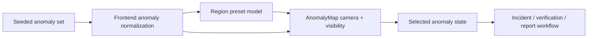

# Kazakhstan-Wide Map Coverage Plan

## Problem Frame

The current real-map slice solved the "fake sketch" problem, but the visible geography is still too narrow for the strongest hackathon story. From the stage, the product should read as a Kazakhstan-wide MRV screening layer with operational follow-through, not as a single western pilot screen.

This plan expands the map into a national demo surface without turning the MVP into a GIS product. The goal is simple:
- open on Kazakhstan-wide coverage
- show more seeded regions with realistic marker distribution
- let the presenter jump quickly between region views
- keep the existing `signal -> incident -> task -> report` loop untouched

This plan is grounded in [2026-03-28-kazakhstan-wide-map-coverage-requirements.md](D:\oil\Duo-Galym-Dauren-Project\docs\brainstorms\2026-03-28-kazakhstan-wide-map-coverage-requirements.md).

## Scope Boundaries

- Do not add region-vs-region comparison tools.
- Do not add methane heatmaps, plume overlays, or polygon boundary systems.
- Do not add flare-specific layers in this slice.
- Do not change incident promotion semantics or workflow steps.
- Do not introduce a dense filtering sidebar or analytics mode.

## Research Summary

### Repo patterns to follow

- The current real map lives in [anomaly-map.tsx](D:\oil\Duo-Galym-Dauren-Project\apps\web\components\anomaly-map.tsx) and already owns map init, marker rendering, and fallback behavior.
- The Signal-step orchestration already derives evidence posture, selection state, and live marker emphasis in [page.tsx](D:\oil\Duo-Galym-Dauren-Project\apps\web\app\page.tsx).
- Seeded anomalies are currently defined once in backend demo state in [demo_store.py](D:\oil\Duo-Galym-Dauren-Project\apps\api\app\services\demo_store.py) and once in frontend fallback data in [demo-data.ts](D:\oil\Duo-Galym-Dauren-Project\apps\web\lib\demo-data.ts).
- The anomaly contract already supports numeric `latitude` / `longitude` in [models.py](D:\oil\Duo-Galym-Dauren-Project\apps\api\app\models.py) and [api.ts](D:\oil\Duo-Galym-Dauren-Project\apps\web\lib\api.ts).
- Backend contract checks already live in [test_demo_store.py](D:\oil\Duo-Galym-Dauren-Project\apps\api\tests\test_demo_store.py) and [test_routes.py](D:\oil\Duo-Galym-Dauren-Project\apps\api\tests\test_routes.py).

### Planning decisions

- Skip external research. This is a bounded demo-surface expansion built on existing repo patterns, not an unknown framework or geospatial integration problem.
- Use seeded anomalies for broader coverage first. That is the fastest credible path to a nationwide surface before submission.
- Implement region jumps as small named presets, not as general map filters or administrative boundaries.
- Keep selection/workflow continuity stronger than map controls. The map is supporting the MRV loop, not replacing it.

## Requirements Trace

- R1 -> widen the default camera behavior so the first screen reads as Kazakhstan-wide
- R2 -> add seeded anomalies across additional Kazakhstan oil-and-gas-relevant regions
- R3 -> introduce named region presets plus `All Kazakhstan`
- R4 -> keep region switching scoped to map focus and visible marker context only
- R5 -> preserve selected anomaly and incident/report continuity across focus changes
- R6 -> keep nationwide behavior working under internal fallback conditions
- R7 -> keep the interaction model minimal and stage-friendly

## Key Decisions

- Use a curated preset set, not arbitrary free navigation. This gives the presenter reliable narration beats and prevents UI clutter.
- Filter visible markers by preset only when useful for clarity. `All Kazakhstan` remains the default national view; regional presets exist to focus the story, not to create a data-exploration tool.
- Expand the seeded anomaly set to around 7-10 markers total. That is enough to read as national coverage without making the screen noisy.
- Prefer oil-and-gas-relevant regions for seeded expansion: Atyrau, Mangystau, Aktobe, West Kazakhstan, Kyzylorda, and one eastern/northern lower-signal anchor if it helps the national framing.
- Keep fallback honest. If the map drops to sketch fallback, the nationwide story should still make sense as a simplified territory board rather than collapsing back to a tiny local cluster.

## High-Level Technical Design

The main change is not a new architecture. It is a new map-state layer that sits between normalized anomaly data and the map component:
- `All Kazakhstan` preset opens on a nationwide view
- region presets constrain camera and, if needed, marker visibility
- selection still flows through the same anomaly/workflow state already used in the Signal step

## Implementation Units

- [x] **Unit 1: Expand seeded anomaly coverage across Kazakhstan**
  Goal: make the dataset visually read as national coverage rather than a western pilot cluster.
  Files:
  - [demo_store.py](D:\oil\Duo-Galym-Dauren-Project\apps\api\app\services\demo_store.py)
  - [demo-data.ts](D:\oil\Duo-Galym-Dauren-Project\apps\web\lib\demo-data.ts)
  - [models.py](D:\oil\Duo-Galym-Dauren-Project\apps\api\app\models.py) only if model comments or enums need adjustment
  - [test_demo_store.py](D:\oil\Duo-Galym-Dauren-Project\apps\api\tests\test_demo_store.py)
  - [test_routes.py](D:\oil\Duo-Galym-Dauren-Project\apps\api\tests\test_routes.py)
  Approach:
  - add new seeded anomalies with credible `region`, `asset_name`, `facility_type`, `latitude`, `longitude`, and signal severity
  - keep one clear stronger cluster and at least one visibly lower-signal region for stage narration
  - avoid adding so many markers that the national view becomes cluttered
  Patterns to follow:
  - mirror the existing seeded anomaly structure in [demo_store.py](D:\oil\Duo-Galym-Dauren-Project\apps\api\app\services\demo_store.py)
  - keep backend and frontend fallback datasets aligned
  Execution note:
  - test-first on backend contract expectations because the main risk is silent data-shape drift
  Test files:
  - [test_demo_store.py](D:\oil\Duo-Galym-Dauren-Project\apps\api\tests\test_demo_store.py)
  - [test_routes.py](D:\oil\Duo-Galym-Dauren-Project\apps\api\tests\test_routes.py)
  Verification:
  - dashboard payload exposes anomalies from multiple Kazakhstan regions
  - fallback data mirrors the same expanded coverage
  - anomaly count remains small enough for clean national rendering

- [x] **Unit 2: Add region presets and nationwide camera behavior**
  Goal: make the map open nationally and let the presenter jump between named region views in one click.
  Files:
  - [anomaly-map.tsx](D:\oil\Duo-Galym-Dauren-Project\apps\web\components\anomaly-map.tsx)
  - [page.tsx](D:\oil\Duo-Galym-Dauren-Project\apps\web\app\page.tsx)
  - [demo-data.ts](D:\oil\Duo-Galym-Dauren-Project\apps\web\lib\demo-data.ts) if preset metadata lives with the demo content
  - [globals.css](D:\oil\Duo-Galym-Dauren-Project\apps\web\app\globals.css)
  Approach:
  - define a small preset list such as `All Kazakhstan`, `Atyrau`, `Mangystau`, `Aktobe`, `West Kazakhstan`, `Kyzylorda`
  - give each preset a camera target or bounds
  - default to `All Kazakhstan` on initial render
  - on preset change, move the map camera cleanly and optionally narrow visible markers for clarity
  Patterns to follow:
  - keep map-specific behavior inside [anomaly-map.tsx](D:\oil\Duo-Galym-Dauren-Project\apps\web\components\anomaly-map.tsx)
  - keep selection and action orchestration in [page.tsx](D:\oil\Duo-Galym-Dauren-Project\apps\web\app\page.tsx)
  Execution note:
  - UI-first; keep the preset model minimal and intentionally non-generic
  Test files:
  - none in this unit; verification is build + manual rehearsal
  Verification:
  - initial map reads as nationwide
  - clicking a preset moves focus in a stable, visible way
  - `All Kazakhstan` returns to national view cleanly

- [x] **Unit 3: Preserve workflow continuity through preset changes**
  Goal: ensure the map expansion strengthens the demo loop instead of fragmenting it.
  Files:
  - [page.tsx](D:\oil\Duo-Galym-Dauren-Project\apps\web\app\page.tsx)
  - [anomaly-map.tsx](D:\oil\Duo-Galym-Dauren-Project\apps\web\components\anomaly-map.tsx)
  - [globals.css](D:\oil\Duo-Galym-Dauren-Project\apps\web\app\globals.css)
  Approach:
  - preserve the currently selected anomaly when the chosen preset still includes it
  - if the preset excludes the selected anomaly, move selection to the strongest visible anomaly within that region
  - keep `Promote / Open incident` CTA and evidence strip synchronized with the currently visible/selected marker
  - keep live sync marker emphasis compatible with regional focus changes
  Patterns to follow:
  - reuse existing `selectedAnomaly`, strongest anomaly, and map reaction logic in [page.tsx](D:\oil\Duo-Galym-Dauren-Project\apps\web\app\page.tsx)
  Execution note:
  - characterization-first around selection fallback behavior; this is the easiest place to introduce confusing state jumps
  Test files:
  - none in this unit; verification is manual workflow rehearsal
  Verification:
  - region changes never leave the Signal step in an empty or contradictory state
  - promote/open incident still works from region-focused views
  - live sync emphasis remains attached to the correct visible marker

- [x] **Unit 4: Align fallback, copy, and demo narration with nationwide coverage**
  Goal: make the wider map story honest, readable, and usable on stage.
  Files:
  - [anomaly-map.tsx](D:\oil\Duo-Galym-Dauren-Project\apps\web\components\anomaly-map.tsx)
  - [site-content.ts](D:\oil\Duo-Galym-Dauren-Project\apps\web\lib\site-content.ts)
  - [demo-script.md](D:\oil\Duo-Galym-Dauren-Project\docs\demo-script.md)
  - [README.md](D:\oil\Duo-Galym-Dauren-Project\README.md)
  Approach:
  - update map copy so `All Kazakhstan` and regional jumps are explained as screening navigation, not precise source location
  - ensure fallback presentation still makes sense with nationwide coverage
  - update the demo script to use a two-stage rhythm: national view first, then regional focus, then incident workflow
  Patterns to follow:
  - keep copy explicit about screening-layer limitations
  Execution note:
  - docs/copy follow-through after interaction behavior is stable
  Test files:
  - none
  Verification:
  - EN and RU copy remain readable
  - narration matches shipped behavior and does not imply comparison tooling or pinpoint precision

## Test Scenarios

### Data and Contract Scenarios

- Expanded anomaly set includes multiple distinct Kazakhstan regions in both backend and fallback data.
- Dashboard contract still returns valid anomaly payloads with numeric coordinates.
- Existing workflow fields (`linkedIncidentId`, report state, tasks) remain intact.

### Map Coverage Scenarios

- Initial load opens on a national Kazakhstan view.
- `All Kazakhstan` shows the full seeded set cleanly.
- Each preset moves focus to a named regional window without breaking the map.

### Workflow Continuity Scenarios

- Switching presets keeps the selected anomaly when still visible.
- Switching presets chooses a sane visible anomaly when the previous one falls outside the preset.
- Promote/open incident still works after preset changes.
- Live sync emphasis remains coherent after preset navigation.

### Failure and Demo-Safety Scenarios

- If the map falls back internally, the simplified fallback still reflects broader territory coverage rather than a single local cluster.
- Region preset controls do not create unusable empty states.
- The screen remains readable on desktop and laptop-sized demo windows.

## Verification

- `py -m pytest` in [apps/api](D:\oil\Duo-Galym-Dauren-Project\apps\api)
- `cmd /c npm.cmd run build --workspace=@duo/web` in [Duo-Galym-Dauren-Project](D:\oil\Duo-Galym-Dauren-Project)
- manual browser rehearsal with local backend:
  - open the Signal step
  - confirm initial nationwide view
  - jump to one higher-signal region and one lower-signal region
  - verify selection/evidence stay coherent
  - run `Sync latest evidence`
  - promote to incident from a focused region
  - return to `All Kazakhstan`

## Risks and Mitigations

- Risk: too many markers make the national view noisy
  - Mitigation: cap seeded anomalies to a small curated set and keep presets explicit

- Risk: preset switching creates confusing selection jumps
  - Mitigation: define a deterministic selection rule when the current anomaly leaves the visible preset

- Risk: nationwide view weakens demo pace by encouraging exploration
  - Mitigation: keep the preset strip small and script the pitch around 1 national view plus 1-2 regional jumps

- Risk: fallback sketch no longer matches the national story
  - Mitigation: evolve fallback presentation in the same slice so the broader coverage remains legible without MapLibre

## Dependencies / Assumptions

- The current real-map slice is already on branch [codex/map-evidence-visibility](D:\oil\Duo-Galym-Dauren-Project) and provides the base surface to extend.
- Seeded anomaly expansion remains acceptable for submission MVP as long as the product keeps honest screening positioning.
- No frontend test harness is required for this slice; build plus manual rehearsal is acceptable under the current deadline.

## Next Steps

→ `ce:work` on this plan
